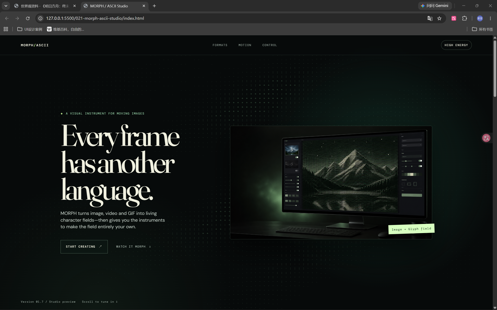

# MORPH / ASCII Studio

这是一个单页产品推荐体验，介绍一款可将图片、视频与 GIF 转换为可编辑 ASCII 字符视觉效果的创作软件。

## 本地打开方式

直接用浏览器打开 `index.html`，或使用任意静态文件服务器运行 `021-morph-ascii-studio` 文件夹。

## 页面内容

- 三张真实生成的产品视觉：桌面创作台、视频转换与 GIF 控制台。
- 三组 Canvas 字符场：首屏云雾、视频波形与结尾螺旋。
- `High energy` / `Quiet field` 控制按钮，用于切换实时动效强度。
- 可悬停的产品格式卡片、页内导航与 CTA 状态反馈。

## 使用的 ASCII 技术

页面结合了实时字符渲染与展示软件能力的产品图片。两者是分开的：Canvas 效果由浏览器实时绘制字符；产品图片用于展示 MORPH 可生成的视觉结果。

| 技术 | 字符 / 原理 | 页面位置 | 视觉效果 |
| --- | --- | --- | --- |
| Canvas 字符网格 | ` .·:+*#%@`，按计算出的场强选择字符 | 首屏、视频功能区、结尾 CTA | 每帧绘制真实字符单元，并非字符截图。 |
| 噪声字符云 | 三组正弦波控制字符可见度与漂移 | 首屏背景 | 用稀疏字符雾和星点填充大面积留白。 |
| 鼠标扰动 | 鼠标附近字符增强强度并改变位置 | 首屏背景 | 光标靠近时，字符会变亮并轻微向光标靠拢。 |
| 波形字符场 | 横向与纵向波形共同改变字符密度 | 视频转换产品图上方 | 形成逐帧扫描与字符重组的感觉。 |
| 螺旋字符场 | 使用极坐标半径和角度决定字符密度 | 结尾 CTA 背景 | 形成缓慢聚拢、展开的字符漩涡。 |
| 扫描线 | CSS 磷光线动画，与 Canvas 网格配合 | 视频转换产品图上方 | 强化实时、逐帧转换的感受。 |
| 小型字符图标 | `#@@#`、`*@*` 等预格式字符组合 | IMAGE、VIDEO、GIF 三张卡片 | 为每种输入格式提供紧凑的 ASCII 标识。 |
| 生成的 ASCII 产品视觉 | 图片素材内用字符呈现场景 | 首屏、视频与控制章节 | 展示虚构软件将山脉、舞者与植物 GIF 转为字符画的能力。 |

### 实时字符场位置

- `.hero-field`：带鼠标扰动的字符云雾。
- `.image-field`：叠加在视频转换图上的波形字符场。
- `.finale-field`：结尾行动区的螺旋字符场。

共享字符集和 `GlyphField` 渲染器位于 `index.html`；页面使用 `IntersectionObserver`，仅在对应章节可见时播放各个字符场。

